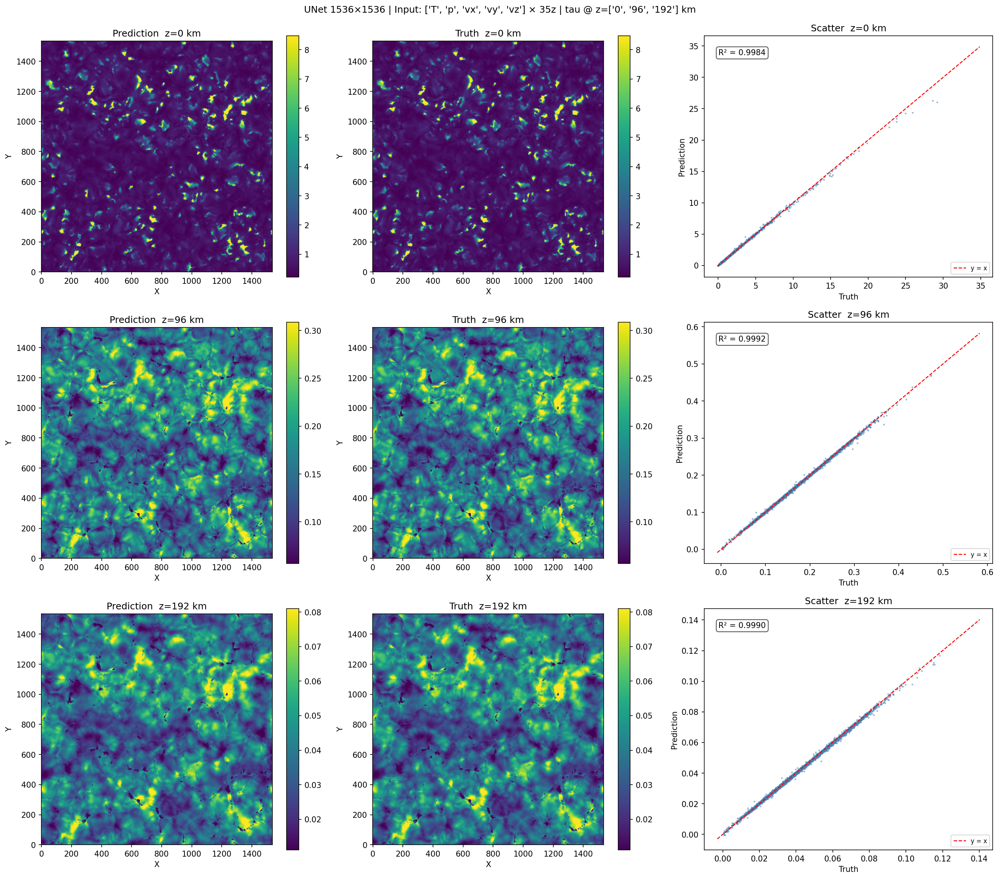
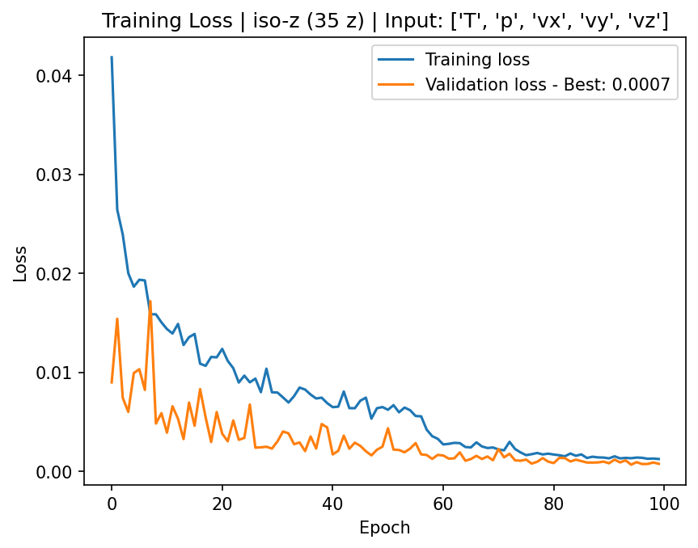
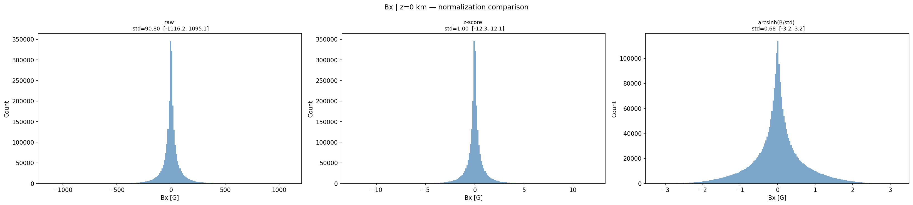
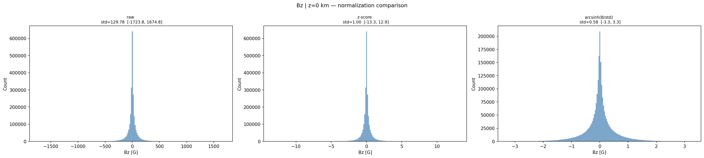
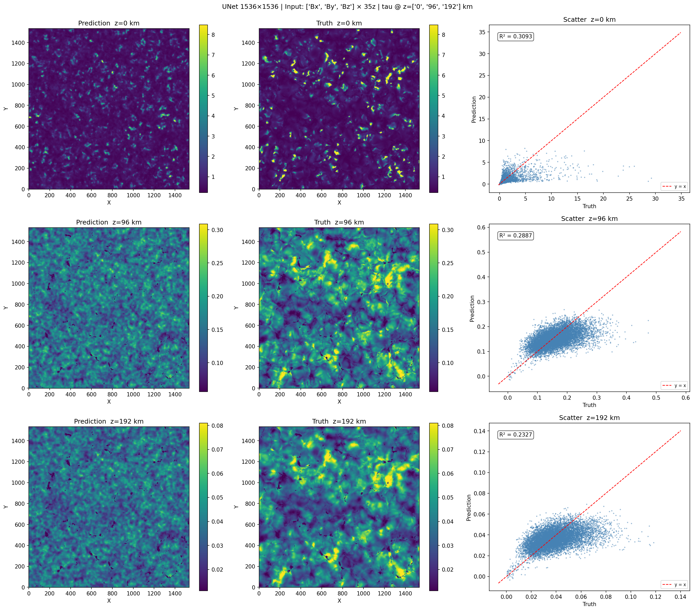

# Reconstructing Solar Corrugation Using Machine Learning

## Data

We use FITS cubes obtained from MuRAM simulation of Solar atmosphere with shape:

| Dimension | Size | Description |
|-----------|------|-------------|
| Channels | 9 | 8 physical parameters + 1 z(tau) map |
| Spatial | 1536 × 1536 | Spatial resolution |
| Depth | 35 | Iso-z layers |

## Task

The goal is to train a network on physical parameters `(8, 1536, 1536, 35)` to predict the z(tau) map `(1, 1536, 1536, 3)`.

For our example we target 3 iso-z layers: **0, 96, 192 km**, and use 5 inputs `T, p, v`.

Notebooks are named **`cnn-iso-z-{type of patch creation}-{physical parms. used for training}.ipynb`**, e.g. `cnn-iso-z-random-tpv.ipynb`

> `v` implies we used `vx`, `vy` and `vz`. Same counts for `B`.

## Results

### Input T, p, vx, vy and vz

  
   
  <em>Image 1: Reconstruction of 3 z layers</em>

  
   
  <em>Image 2: Loss values</em>

### Normalization testing

Here we test how the normalization of magnetic field influences the training and prediction on neural network for only magnetic inputs. We test z-score or standard normalization $(B - B_{mean})/\sigma$ against `arcsinh` or $arcsinh(B / \sigma)$. 

Let's show the distributions of magnetic values on $z = 0 \ km$:

  
   
  <em>Image 3: Distributions and normalizations of Bx</em>

  
   
  <em>Image 4: Distributions and normalizations of By</em>

  
   
  <em>Image 5: Distributions and normalizations of Bz</em>

Unfortunately both normalizations give dissapointing results from reconstruction, `arcsinh` 1% better than the standard norm.

  
   
  <em>Image 6: Reconstruction using standard normalization</em>

